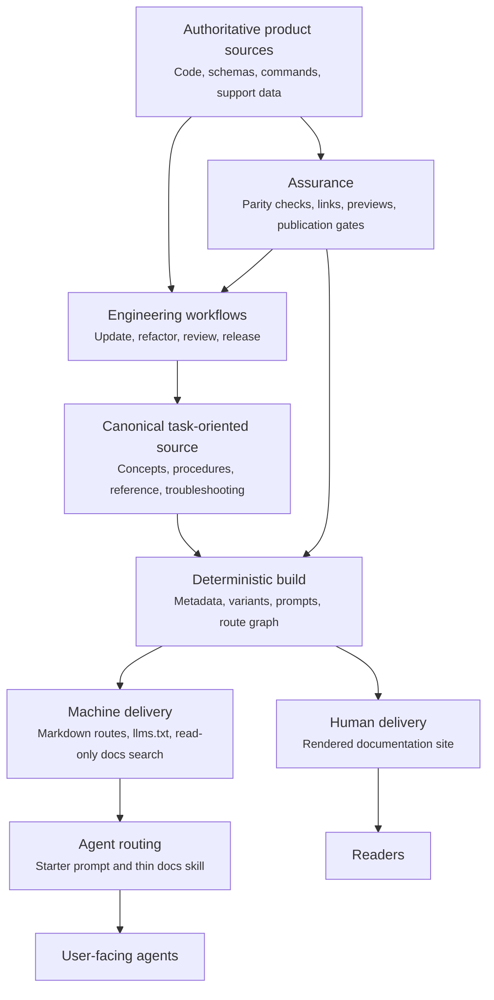

Agentic documentation is a documentation system that helps an AI agent find the right source, apply it to the user's context, take bounded action, and verify the result.
It serves people and agents from one governed source instead of maintaining a website, prompt library, and skill catalog as separate bodies of content.

This guide turns the current NemoClaw documentation architecture into a reusable model for other engineering teams.
The file names and tools are NemoClaw examples, but the contracts apply to any docs-as-code stack.

<Note>
Making HTML available to a model is not enough.
An agent-ready system needs explicit retrieval paths, task metadata, stable routes, safety boundaries, and evidence that the published guidance still matches the product.
</Note>

## Define the Product Contract

Start with observable outcomes instead of selecting tools.
A reliable agentic documentation system supports the following contract.

| Capability | Contract | Evidence |
|---|---|---|
| Discover | The agent can identify the relevant document for a user task. | A task query returns the intended page and variant. |
| Retrieve | The agent can fetch clean, current, citable content. | A stable Markdown route or read-only search tool returns the canonical source. |
| Apply | The guidance includes decisions, prerequisites, steps, and boundaries. | The agent produces instructions scoped to the user's environment. |
| Act | The agent knows which operations are safe, which need approval, and which are out of scope. | Workflow instructions stop before credentials, destructive changes, or unsupported surfaces. |
| Verify | Every procedure ends with an observable success check. | The agent runs or recommends the documented validation step. |
| Maintain | Product changes can be traced to documentation owners and release evidence. | Pull-request gates detect stale, missing, or unpublished guidance. |

Treat failures in any row as documentation defects.
A polished site with weak retrieval or verification is not agent-ready.

## Use a Layered Architecture

Keep content, delivery, routing, workflow, and assurance separate so each layer has one responsibility.



The source remains authoritative throughout the loop.
Prompts, skills, generated variants, search indexes, and rendered pages are delivery or control artifacts, not alternate sources of truth.

## Establish One Canonical Owner

Write each fact once in its authoritative layer, then produce the human and machine experiences from one publication source.
Product behavior may be authoritative in code, schemas, command metadata, or support data, while the documentation corpus remains the canonical published explanation.
Generate structured reference content from product sources when practical and use parity tests when prose must remain hand-written.

NemoClaw uses MDX under `docs/` as its user-facing source of truth and generates agent-specific pages during the docs build.

Apply these source rules:

- Give each page one primary concept or user task.
- Organize procedures around the reader journey from choosing through setup, operation, validation, and troubleshooting.
- Keep reusable troubleshooting and reference facts with one canonical owner, then link to that owner.
- Generate tables and reference values from authoritative product data when that removes manual synchronization.
- Store navigation, slugs, and variant membership in a machine-readable index.
- Treat generated pages as disposable build output and never edit them by hand.
- Preserve published routes with direct redirects when content moves.

Use frontmatter to describe the page for both people and retrieval systems.
The human description explains the value of the page, while the agent description states what the page helps with and when to select it.

```yaml
---
title: "Configure a Private Package Registry"
description: "Connect the product to a private package registry and verify authenticated downloads."
description-agent: "Configures and validates private package registry access. Use when users ask about registry credentials, package download failures, or enterprise package mirrors."
keywords: ["private registry", "package authentication", "enterprise mirror"]
content:
  type: "how_to"
---
```

Good routing metadata names the user intent, scope, and likely trigger phrases.
It does not repeat the page body or make unsupported product claims.

## Publish Machine-Readable Delivery Paths

Publish clean content through more than one retrieval path because agent environments have different capabilities.
Use this retrieval order:

1. Search a read-only documentation service when the client supports a structured tool such as MCP.
2. Fetch a lightweight documentation index such as `llms.txt` when structured search is unavailable.
3. Fetch the specific Markdown page returned by search or listed in the index.
4. Fall back to rendered HTML only when a clean machine-readable route is unavailable.

Each path should resolve to the same release and canonical page.
Do not make the agent reconcile copied content from several repositories or prompt bundles.

Machine delivery is ready when the following checks pass:

- Every published task page has a stable Markdown representation.
- The documentation index contains the current public route set.
- Search results return source URLs that an answer can cite.
- Variant-specific queries do not silently mix incompatible instructions.
- Moved pages redirect directly to a current published destination.
- Private drafts and unsupported features do not enter the public index.

NemoClaw exposes its canonical pages through Markdown routes, `llms.txt`, and a read-only docs MCP server.
The [Use NemoClaw Docs with Your Coding Agents](agent-skills) page shows the user-facing retrieval flow.

## Keep Agent Routing Thin

Use prompts and skills to route the agent, not to store another copy of the docs.
A routing layer should tell the agent where to look, how to choose a source, and what response constraints to follow.

A small routing skill needs only the following elements:

- The canonical search endpoint and fallback documentation index.
- The preferred order for retrieving pages.
- The main task areas and their starting pages.
- Variant or platform selection rules.
- Safety requirements for approvals, credentials, and destructive actions.
- Citation and verification requirements.

This pattern keeps the routing artifact stable while the product documentation changes frequently.
It also avoids large generated skills that drift from the public site, consume context, and create ambiguous ownership.

Pair the routing skill with a starter prompt for users who have not installed project instructions.
Keep the starter prompt in a standalone canonical file, generate any website component from that file, and test that embedded or pinned copies still match it.

## Encode Documentation Work as Agent Workflows

Agentic docs include the workflows that maintain the corpus, not only the content agents retrieve.
Turn repeatable documentation engineering practices into bounded skills or repository instructions with explicit inputs, stop conditions, and evidence.

| Workflow | Trigger | Required inputs | Completion evidence |
|---|---|---|---|
| Update docs | Product behavior changes or docs fall behind code. | Commit range, changed files, product scope, current pages. | Each user-visible change maps to an updated page or a documented no-impact decision. |
| Refactor information architecture | A section is oversized, duplicated, or hard to navigate. | Heading inventory, ownership map, inbound routes, supported variants. | One owner per topic, migrated routes, readable pages, and no content loss. |
| Review docs | A pull request changes a public procedure or reference. | Product implementation, tests, rendered preview, style policy. | Accuracy, links, route publication, and task verification pass. |
| Prepare a release | A release candidate is ready for documentation. | Merged change set, release scope, target version and date. | Canonical changelog entry lands before the release tag. |
| Publish | A docs change merges or a release tag is created. | Validated source, approved environment, immutable revision. | Staging or public output points to the expected revision. |

NemoClaw applies this model through layered repository instructions and specialized contributor and maintainer skills.
The update workflow scans commits, respects a documentation skip list, maps behavior to canonical pages, and verifies the build.
The refactor workflow inventories every topic, defines ownership and URL migration contracts, and validates every supported variant.

Design each workflow to produce evidence instead of a generic statement that the docs were updated.
The agent should report the files changed, source behavior represented, checks run, and intentionally deferred work.

## Generate Variants Without Duplicating Sources

Many products publish documentation for editions, platforms, runtimes, or deployment models.
Generate a variant only when most of the source is shared.

Use these rules:

- Replace a build-time placeholder when only a literal name or command differs.
- Use a conditional block when the workflow, behavior, state layout, or security boundary differs.
- Use a separate source page when most of the procedure is variant-specific.
- Keep variant membership and route slugs in the navigation model.
- Regenerate every variant before route and link validation.
- Inspect rendered variants for broken lists, joined paragraphs, and missing context.

NemoClaw generates shared OpenClaw, Hermes, and Deep Agents pages from one MDX source.
Its build rewrites the host CLI placeholder, removes inapplicable conditional blocks, and publishes a distinct route for each supported agent.

## Treat Documentation as an Executable Product Surface

Build deterministic checks around the contracts that matter to users and agents.
Syntax validation alone does not catch behavioral drift.

| Gate | Defect it prevents | NemoClaw example |
|---|---|---|
| Source formatting | Unreadable diffs and inconsistent authoring. | Markdown linting, one sentence per source line, and copyable command rules. |
| Generated freshness | Stale prompts or agent variants. | Build-time generation followed by read-only freshness checks. |
| Route graph | Links or redirects that target unpublished pages. | Published-route validation derived from `docs/index.yml`. |
| Product parity | Reference documentation that disagrees with the product. | CLI command, flag, installer, and environment-variable parity checks. |
| Pull-request preview | Layout or navigation failures hidden by source checks. | An isolated Fern preview for each docs pull request. |
| Staging publish | A merge that cannot produce the deployed site. | Validation and publication from `main`. |
| Public release gate | Public docs from an unapproved or detached revision. | Release-tag publication only when the tagged commit is reachable from `main`. |

Run the narrowest checks on every relevant change and keep broader checks at integration or release boundaries.
Tests should derive routes and behavior from the same source models used by the product instead of maintaining a second hard-coded catalog.

## Govern What Agents May Publish

Fast documentation automation needs a stronger scope gate, not a weaker one.
Documentation can accidentally turn an experiment into an apparent supported product surface.

Define the following controls:

- Require an accepted product decision before documenting a new integration, recipe, or supported workflow as canonical behavior.
- Maintain an explicit skip list for merged features that are not ready for public documentation.
- Block restricted terms and private implementation details from generated output.
- Separate public user guidance from contributor and maintainer procedures.
- Require agent workflows to stop before handling secrets, changing accounts, or performing destructive operations without approval.
- Assign an owner and lifecycle expectation to every canonical page and generated artifact.

NemoClaw applies the same scope gate to code review and documentation review.
A working example and a green build establish technical evidence, but they do not establish product approval.

## Measure Retrieval and Task Quality

Measure whether agents can complete documentation-backed tasks, not only whether pages receive traffic.

Track a small evaluation set across common and high-risk user journeys:

- Retrieval accuracy, measured by whether the intended canonical page appears in the first results.
- Variant accuracy, measured by whether the answer stays within the selected platform or product edition.
- Citation coverage, measured by whether behavior claims point to the current source page.
- Task completion, measured by whether the documented procedure reaches its success check.
- Safety compliance, measured by whether the agent stops at approval, credential, and destructive-action boundaries.
- Freshness, measured by the delay between a product change and its verified documentation update.
- Drift detection, measured by which parity gate catches an intentionally stale fixture.

Keep evaluation prompts versioned with the documentation system.
Add a regression case when a user report or review reveals that an agent selected the wrong source, mixed variants, skipped a safety boundary, or failed to verify the outcome.

## Adopt the Model in Phases

Build the smallest complete loop first, then add sophistication where evidence shows a need.

| Phase | Deliverable | Exit condition |
|---|---|---|
| Foundation | One canonical, task-oriented Markdown or MDX corpus. | Humans can complete one priority journey from the source docs. |
| Machine delivery | Stable Markdown routes and a lightweight index. | An agent can retrieve and cite the same priority journey without scraping HTML. |
| Routing | A starter prompt and thin routing skill. | The agent selects the correct page, variant, and verification step. |
| Workflow | Repository instructions and an update-docs workflow. | A product change produces a traceable docs-impact decision. |
| Assurance | Route, link, generation, parity, and preview gates. | A deliberately stale or broken fixture fails before merge. |
| Scale | Variants, structured docs search, release automation, and evaluation suites. | Additional products or platforms do not create parallel content ownership. |

Do not begin with a large generated skill catalog or autonomous publishing workflow.
Begin with one high-value user journey and prove the complete source-to-retrieval-to-verification loop.

## Map the NemoClaw Implementation

The current NemoClaw repository provides concrete examples for each layer.

| Concern | NemoClaw implementation |
|---|---|
| Canonical content | `docs/**/*.mdx`. |
| Authoring and review policy | `docs/CONTRIBUTING.md` and `docs/AGENTS.md`. |
| Navigation and variants | `docs/index.yml`. |
| Site and redirect configuration | `fern/docs.yml` and `fern/fern.config.json`. |
| Machine delivery | Published Markdown routes, `llms.txt`, and the read-only docs MCP server. |
| Routing skill | `.agents/skills/nemoclaw-user-guide/SKILL.md`. |
| Starter prompt | `docs/resources/starter-prompt.md` and `scripts/generate-starter-prompt.mts`. |
| Product-owned generated facts | `ci/platform-matrix.json` and `scripts/generate-platform-docs.py`. |
| Variant generation | `scripts/sync-agent-variant-docs.mts`. |
| Route validation | `scripts/check-docs-published-routes.mts`. |
| Update workflow | `.agents/skills/nemoclaw-contributor-update-docs/SKILL.md`. |
| Information-architecture workflow | `.agents/skills/nemoclaw-maintainer-refactor-docs/SKILL.md`. |
| Pull-request assurance | Docs link, product parity, and preview workflows under `.github/workflows/`. |
| Release history | Dated entries under `docs/changelog/` that land before the release tag. |
| Release publication | Staging publication from `main` and public publication from release tags. |

Use this map as a reference architecture, not a requirement to adopt the same vendor or repository layout.
Preserve the contracts when adapting the implementation.

## Review Readiness

Before calling a documentation system agent-ready, confirm the following conditions:

- One governed source produces the human and machine documentation experiences.
- Every priority task has routing metadata, a stable machine-readable route, and a verification step.
- Search, the docs index, and rendered navigation resolve to the same release and canonical owner.
- Routing prompts and skills point to the source instead of copying it.
- Variant generation is deterministic and variant behavior is tested.
- Agent workflows define scope, approvals, stop conditions, and completion evidence.
- Pull requests validate generated output, routes, links, product parity, and rendered previews.
- Release publication uses an approved immutable revision.
- Retrieval, citation, task, variant, safety, and freshness regressions have repeatable evaluations.

The first practical milestone is one product journey that passes every condition above.
Expand the system only after that loop is reliable.
