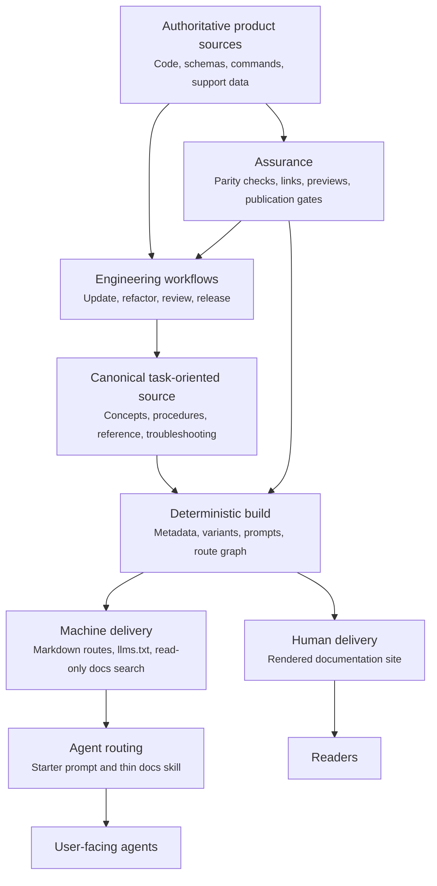

Agentic documentation is a documentation system that helps an AI agent find the right source, apply it to the user's context, take bounded action, and verify the result.
It serves people and agents from one governed source instead of maintaining a website, prompt library, and skill catalog as separate bodies of content.
It also places agents inside the documentation lifecycle so product changes arrive with accurate documentation instead of becoming a later handoff to a writing team.

This guide turns the current NemoClaw documentation architecture into a reusable model for other engineering teams.
The file names and tools are NemoClaw examples, but the contracts apply to any docs-as-code stack.

<Note>
Making HTML available to a model is not enough.
An agent-ready system needs explicit retrieval paths, task metadata, stable routes, safety boundaries, and evidence that the published guidance still matches the product.
</Note>

## Define the Product Contract

Start with observable outcomes instead of selecting tools.
A reliable agentic documentation system supports the following contract.

| Capability | Contract | Evidence |
|---|---|---|
| Discover | The agent can identify the relevant document for a user task. | A task query returns the intended page and variant. |
| Retrieve | The agent can fetch clean, current, citable content. | A stable Markdown route or read-only search tool returns the canonical source. |
| Apply | The guidance includes decisions, prerequisites, steps, and boundaries. | The agent produces instructions scoped to the user's environment. |
| Act | The agent knows which operations are safe, which need approval, and which are out of scope. | Workflow instructions stop before credentials, destructive changes, or unsupported surfaces. |
| Verify | Every procedure ends with an observable success check. | The agent runs or recommends the documented validation step. |
| Maintain | Product changes can be traced to documentation owners and release evidence. | Pull-request gates detect stale, missing, or unpublished guidance. |

Treat failures in any row as documentation defects.
A polished site with weak retrieval or verification is not agent-ready.

## Move Documentation Into the Engineering Loop

Many documentation workflows begin after engineering work is complete.
The writer identifies which features are shipping, finds the responsible engineers, interviews them to reconstruct the behavior, and then creates a separate documentation change.
This manual intake phase consumes time and can lose important context between implementation and publication.

NemoClaw moves routine documentation work into the developer's engineering pull request.
The agent working on the developer's machine can inspect the code, tests, issue, and pull-request context while the change is still fresh.
Repository instructions tell that agent when documentation is required, where the content belongs, how to write it, and which checks prove the result.

| Stage | Separate documentation handoff | Repository-embedded workflow |
|---|---|---|
| Discover changes | A writer collects release scope from meetings, messages, and issue lists. | The developer's agent inspects the current diff, issue, and changed behavior. |
| Transfer knowledge | A writer interviews engineers and reconstructs implementation details. | The agent reads the implementation and tests, then asks only when a decision or supported contract is unclear. |
| Draft documentation | A writer creates a later documentation task or pull request. | The agent updates the canonical page in the engineering pull request. |
| Review accuracy | Documentation and implementation may be reviewed at different times. | Reviewers see the behavior, tests, and documentation together. |
| Prepare a release | A writer performs a broad catch-up pass before publication. | Continuous updates reduce catch-up work, while the release workflow verifies completeness and creates the canonical changelog entry. |

The repository provides a control stack for this workflow:

- The root `AGENTS.md` defines repository-wide success criteria, product scope, and documentation expectations.
- `docs/AGENTS.md` defines the documentation role, source-of-truth rules, variant patterns, and verification requirements.
- `docs/CONTRIBUTING.md` defines the public writing, navigation, release, and review contracts.
- The `nemoclaw-contributor-update-docs` skill maps product changes to canonical pages and produces an evidence-backed documentation update.
- Build scripts, tests, hooks, previews, and publication workflows enforce the contracts after the agent edits the files.

The expected pull-request loop is direct:

1. The developer's agent reads the repository and documentation instructions.
2. It inspects the implemented behavior and its tests.
3. It decides whether the change has user-facing documentation impact.
4. It updates the canonical page in the same pull request when documentation is required.
5. It runs the relevant documentation and product-parity checks.
6. It reports the pages changed, behavior represented, and verification evidence.

This model removes the need for a writer to manually reconstruct every incremental product change.
It does not remove documentation ownership.
It shifts the writer's role toward designing the system, maintaining the instructions, monitoring outcomes, and handling work that requires editorial judgment.
When the instructions are working, the writer can review by exception.
Routine pull-request updates that already meet the documentation contract do not need line editing, so the writer can focus on unclear product scope, structural pressure, and recurring failure patterns.

## Make Documentation Review Observable

A repository instruction can require a documentation writer subagent, but the instruction alone does not show whether an engineering agent followed it.
Add a structured pull-request receipt so each code or documentation change produces observable documentation-review evidence.

NemoClaw records the following fields in the Documentation Writer Review section of the pull-request description:

- A completed-review checkbox.
- One result: `docs-updated`, `no-docs-needed`, or `blocked`.
- Evidence that names the changed documentation or explains the result.
- The agent product and surface that ran the review.
- Hidden metadata for the reviewed head SHA and the `AGENTS.md` blob SHA.

Keep one instance of each field.
GitHub supplies the pull-request identity to the workflow and report.
The head SHA binds the review to one pull-request revision.
The `AGENTS.md` blob SHA records which repository instruction version the review covered.

Use the following sequence for a pull request that changes code or documentation:

1. Run the documentation writer subagent after the changes and applicable validation are complete.
2. For code changes, update the canonical documentation or record why no documentation change is required.
3. For documentation changes, verify the writing rules and documentation style.
4. Commit all changes from the review.
5. Complete the visible receipt and hidden metadata for the committed head.
6. Rerun the documentation review after any later commit.

The `CI / Documentation Writer Review` workflow runs when a pull request opens or reopens, when its description is edited, or when it receives a new commit.
It compares the receipt with the current head and current `AGENTS.md` blob.
A new commit makes the previous receipt stale until the documentation writer subagent runs again and refreshes the metadata.
The checker evaluates code-changing and documentation-only pull requests.
For documentation-only changes, the receipt records the agent's review of writing rules and documentation style.
NemoClaw keeps this check advisory during the data-collection pilot.

<Note>
A valid receipt does not prove that an agent loaded or understood `AGENTS.md`.
It records observable workflow compliance that can be compared with documentation outcomes.
</Note>

### Measure Workflow Adoption

Export receipt data from pull-request descriptions with the authenticated GitHub CLI session.
The report returns JSON by default and also supports CSV and summary output.

```bash
npm run docs-review:report -- --since 2026-07-01 --format summary
```

Use a consistent reporting window and track the following measures:

| Measure | What it shows |
|---|---|
| Eligible pull requests | The total in `eligiblePrs`, plus the code and documentation-only counts in `eligibleCodePrs` and `eligibleDocsOnlyPrs`. |
| Receipt coverage | The share of eligible code-changing and documentation-only pull requests that contain a receipt. |
| Valid receipt rate | The share of eligible pull requests whose receipt has one complete and consistent set of fields. |
| Fresh receipt rate | The share of recorded receipts tied to the pull request's current head. |
| Result distribution | The number of receipts that report `docs-updated`, `no-docs-needed`, or `blocked`. |
| Agent surface | The agent products and surfaces recorded by valid receipts. |
| Unclassified pull requests | Pull requests whose Type of Change selection does not establish whether code or documentation changed. |

Receipt trends show whether the repository workflow is being followed.
They do not establish that the instructions caused a documentation improvement.
Pair the report with accuracy sampling, editorial-intervention rates, and recurring review findings before changing the instruction or making the check required.

## Use a Layered Architecture

Keep content, delivery, routing, workflow, and assurance separate so each layer has one responsibility.



The source remains authoritative throughout the loop.
Prompts, skills, generated variants, search indexes, and rendered pages are delivery or control artifacts, not alternate sources of truth.

## Establish One Canonical Owner

Write each fact once in its authoritative layer, then produce the human and machine experiences from one publication source.
Product behavior may be authoritative in code, schemas, command metadata, or support data, while the documentation corpus remains the canonical published explanation.
Generate structured reference content from product sources when practical and use parity tests when prose must remain hand-written.

NemoClaw uses MDX under `docs/` as its user-facing source of truth and generates agent-specific pages during the docs build.

Apply these source rules:

- Give each page one primary concept or user task.
- Organize procedures around the reader journey from choosing through setup, operation, validation, and troubleshooting.
- Keep reusable troubleshooting and reference facts with one canonical owner, then link to that owner.
- Generate tables and reference values from authoritative product data when that removes manual synchronization.
- Store navigation, slugs, and variant membership in a machine-readable index.
- Treat generated pages as disposable build output and never edit them by hand.
- Preserve published routes with direct redirects when content moves.

Use frontmatter to describe the page for both people and retrieval systems.
The human description explains the value of the page, while the agent description states what the page helps with and when to select it.

```yaml
---
title: "Configure a Private Package Registry"
description: "Connect the product to a private package registry and verify authenticated downloads."
description-agent: "Configures and validates private package registry access. Use when users ask about registry credentials, package download failures, or enterprise package mirrors."
keywords: ["private registry", "package authentication", "enterprise mirror"]
content:
  type: "how_to"
---
```

Good routing metadata names the user intent, scope, and likely trigger phrases.
It does not repeat the page body or make unsupported product claims.

## Publish Machine-Readable Delivery Paths

Publish clean content through more than one retrieval path because agent environments have different capabilities.
Use this retrieval order:

1. Search a read-only documentation service when the client supports a structured tool such as MCP.
2. Fetch a lightweight documentation index such as `llms.txt` when structured search is unavailable.
3. Fetch the specific Markdown page returned by search or listed in the index.
4. Fall back to rendered HTML only when a clean machine-readable route is unavailable.

Each path should resolve to the same release and canonical page.
Do not make the agent reconcile copied content from several repositories or prompt bundles.

Machine delivery is ready when the following checks pass:

- Every published task page has a stable Markdown representation.
- The documentation index contains the current public route set.
- Search results return source URLs that an answer can cite.
- Variant-specific queries do not silently mix incompatible instructions.
- Moved pages redirect directly to a current published destination.
- Private drafts and unsupported features do not enter the public index.

NemoClaw exposes its canonical pages through Markdown routes, `llms.txt`, and a read-only docs MCP server.
The [Use NemoClaw Docs with Your Coding Agents](agent-skills) page shows the user-facing retrieval flow.

## Keep Agent Routing Thin

Use prompts and skills to route the agent, not to store another copy of the docs.
A routing layer should tell the agent where to look, how to choose a source, and what response constraints to follow.

A small routing skill needs only the following elements:

- The canonical search endpoint and fallback documentation index.
- The preferred order for retrieving pages.
- The main task areas and their starting pages.
- Variant or platform selection rules.
- Safety requirements for approvals, credentials, and destructive actions.
- Citation and verification requirements.

This pattern keeps the routing artifact stable while the product documentation changes frequently.
It also avoids large generated skills that drift from the public site, consume context, and create ambiguous ownership.

Pair the routing skill with a starter prompt for users who have not installed project instructions.
Keep the starter prompt in a standalone canonical file, generate any website component from that file, and test that embedded or pinned copies still match it.

## Encode Documentation Work as Agent Workflows

Agentic docs include the workflows that maintain the corpus, not only the content agents retrieve.
Turn repeatable documentation engineering practices into bounded skills or repository instructions with explicit inputs, stop conditions, and evidence.

| Workflow | Trigger | Required inputs | Completion evidence |
|---|---|---|---|
| Update docs | Product behavior changes or docs fall behind code. | Commit range, changed files, product scope, current pages. | Each user-visible change maps to an updated page or a documented no-impact decision. |
| Refactor information architecture | A section is oversized, duplicated, or hard to navigate. | Heading inventory, ownership map, inbound routes, supported variants. | One owner per topic, migrated routes, readable pages, and no content loss. |
| Review docs | A pull request changes a public procedure or reference. | Product implementation, tests, rendered preview, style policy. | Accuracy, links, route publication, and task verification pass. |
| Prepare a release | A release candidate is ready for documentation. | Merged change set, release scope, target version and date. | Canonical changelog entry lands before the release tag. |
| Publish | A docs change merges or a release tag is created. | Validated source, approved environment, immutable revision. | Staging or public output points to the expected revision. |

NemoClaw applies this model through layered repository instructions and specialized contributor and maintainer skills.
The update workflow scans commits, respects a documentation skip list, maps behavior to canonical pages, and verifies the build.
The refactor workflow inventories every topic, defines ownership and URL migration contracts, and validates every supported variant.

Design each workflow to produce evidence instead of a generic statement that the docs were updated.
The agent should report the files changed, source behavior represented, checks run, and intentionally deferred work.

## Let the Corpus Grow and Tend It

Do not require every engineering pull request to redesign the documentation structure.
Let agents make small, accurate updates to the current canonical page while the product evolves.
Restructure the corpus after repeated changes reveal its real shape.

This is continuous growth with periodic curation.
The daily engineering loop keeps behavior and documentation aligned, while a daily or weekly maintenance pass improves sections that have outgrown their original purpose.

Use observable signals to start a restructuring pass:

- A page serves several distinct user tasks.
- A section has become difficult to scan or navigate.
- A paragraph contains several decisions, procedures, or failure modes.
- The same guidance appears in several pages.
- A common task is buried under an unrelated heading or navigation group.
- Product variants have started to drift because their shared and distinct behavior is unclear.

During the maintenance pass, split overgrown pages, clarify headings, move reusable reference material to one owner, remove duplication, and preserve published routes.
If agents repeatedly produce the same structural or style problem, improve the repository instructions or workflow skill so later pull requests correct the pattern at its source.

This cadence avoids premature reorganization while keeping the documentation usable as it grows.
It also reserves the writer's time for structure, user journeys, and editorial quality instead of routine transcription.

## Generate Variants Without Duplicating Sources

Many products publish documentation for editions, platforms, runtimes, or deployment models.
Generate a variant only when most of the source is shared.

Use these rules:

- Replace a build-time placeholder when only a literal name or command differs.
- Use a conditional block when the workflow, behavior, state layout, or security boundary differs.
- Use a separate source page when most of the procedure is variant-specific.
- Keep variant membership and route slugs in the navigation model.
- Regenerate every variant before route and link validation.
- Inspect rendered variants for broken lists, joined paragraphs, and missing context.

NemoClaw generates shared OpenClaw, Hermes, and Deep Agents pages from one MDX source.
Its build rewrites the host CLI placeholder, removes inapplicable conditional blocks, and publishes a distinct route for each supported agent.

### Separate the Source from Its Variant Targets

Authors edit the normal source page under `docs/`.
For this guide, the only source is `docs/resources/engineer-agentic-documentation.mdx`.
The repository does not maintain separate OpenClaw, Hermes, and Deep Agents source copies.

### Author Shared and Variant-Specific Content

Write ordinary prose once when the meaning is the same for every supported agent.
Use the <code>&#36;&#36;nemoclaw</code> placeholder when the only difference is the host CLI binary name.
The variant build resolves that placeholder as follows:

| Generated variant | Placeholder output |
|---|---|
| OpenClaw | `nemoclaw`. |
| Hermes | `nemohermes`. |
| Deep Agents | `nemo-deepagents`. |

Use the placeholder in prose, inline code, and fenced command examples on shared source pages.
Do not duplicate a paragraph or command block only to change the binary name.
Do not use the placeholder on a single-variant source page because that page does not pass through variant generation and would publish the placeholder literally.

Use an `<AgentOnly>` block when the content differs by behavior, workflow, state layout, support, or agent-specific wording.
For example, start a Hermes-only block with <code>&lt;AgentOnly variant="hermes"&gt;</code> and close it with <code>&lt;/AgentOnly&gt;</code>.
The `variant` attribute can name one variant or a comma-separated set such as `openclaw,hermes`.

Do not import `AgentOnly` from a React component.
The canonical page is an intermediate source that the variant resolver compiles before Fern reads it.
The resolver removes the directive tags and keeps the block body only when the target variant appears in the `variant` attribute.

Apply this decision rule:

- Use ordinary shared prose when the meaning is identical.
- Use the host CLI placeholder when only the binary name differs.
- Use `<AgentOnly>` when the meaning or procedure differs.
- Use a separate source page when most of the page is specific to one agent.

This page encodes the two dollar signs as character entities so a future generated variant can display the literal placeholder instead of resolving it.

### Treat `AgentOnly` as a Build-Time Directive

The `<AgentOnly>` syntax resembles an MDX component, but NemoClaw treats it as a build-time directive.
Agent variant selection does not depend on pathname detection or client-side logic in the rendered site.
The canonical source does not need an import because Fern receives only the resolved generated page.

For each navigation target, `scripts/sync-agent-variant-docs.mts` reads the requested variant from `docs/index.yml` and parses the canonical source as text.
When an `<AgentOnly>` directive lists the active variant, the resolver copies its content into the generated page.
When the retained content starts with a Markdown list item, it discards blank lines immediately inside the opening and closing tags so wrapper formatting does not split the list.
For other retained content, it preserves those boundary blank lines and all interior blank lines so paragraphs and code sections keep their intended separation.
When the directive does not list the active variant, the resolver omits the body.
In both cases, it removes the opening and closing directive tags before writing the generated MDX.

Keep the opening and closing `<AgentOnly>` tags at the first column on their own lines, and do not nest these blocks.
That line-oriented structure is the generator's authoring interface, and the resolver reports nested, unexpected, or unclosed blocks as errors.

The `CLI_SENTINEL` constant and replacement table live in `scripts/sync-agent-variant-docs.mts` so placeholders can be resolved inside frontmatter, ordinary prose, inline code, and fenced command blocks before Fern renders the page.
Use <code>&#36;&#36;nemoclaw</code> for all shared host CLI references and wrap it in backticks when it should render as inline code.

The resolver rejects a generated page if it still contains an unresolved line-oriented `<AgentOnly>` directive or a runtime agent component.
These checks make static resolution a publishing invariant instead of relying on client-side hydration to correct variant content.

Variant membership is explicit in `docs/index.yml`.
Each agent variant contains its own navigation tree, and a shared page appears in a tree through a generated target path with this contract:

```text
_build/agent-variants/<source-directory>/<source-name>.<variant>.generated.mdx
```

The `<variant>` value is `openclaw`, `hermes`, or `deepagents`.
The directory and base name before the variant suffix must match the canonical source path under `docs/`.

If this source-only guide is added to Fern navigation, it would use the following mapping:

| Variant | Generated target in `docs/index.yml` | Published route suffix |
|---|---|---|
| OpenClaw | `_build/agent-variants/resources/engineer-agentic-documentation.openclaw.generated.mdx` | `/user-guide/openclaw/resources/engineer-agentic-documentation`. |
| Hermes | `_build/agent-variants/resources/engineer-agentic-documentation.hermes.generated.mdx` | `/user-guide/hermes/resources/engineer-agentic-documentation`. |
| Deep Agents | `_build/agent-variants/resources/engineer-agentic-documentation.deepagents.generated.mdx` | `/user-guide/deepagents/resources/engineer-agentic-documentation`. |

The site and version prefixes are added by the Fern site configuration.
The route suffix above comes from the variant, section, and page slug hierarchy in `docs/index.yml`.

### Use the Fern Index as the Mapping Layer

The version entry in `fern/docs.yml` points Fern to `docs/index.yml`.
That index defines the navigation and published route tree for every supported agent variant.

An OpenClaw navigation entry for this guide would use the following shape:

```yaml
- page: "Engineer Agentic Docs"
  path: _build/agent-variants/resources/engineer-agentic-documentation.openclaw.generated.mdx
  slug: engineer-agentic-documentation
```

The `path` tells Fern which generated MDX file to render.
The `slug` tells Fern the page's final route segment.
The surrounding `resources` section and `openclaw` variant contribute the parent route segments.

This separation has several consequences:

- A source file's filesystem location does not independently define its public URL.
- The same source can be published in several variant trees with the same page slug.
- A source can remain single-variant by pointing navigation directly to its source MDX file instead of a generated target.
- Moving or renaming a published page requires a navigation update and a redirect review, even when the source file stays in the same directory.
- Generated filenames are an interface with the generator and should not use an arbitrary naming pattern.

### Resolve and Render Each Target

The resolver is `scripts/sync-agent-variant-docs.mts`.
Run it directly through `npm run docs:sync-agent-variants`, or let `npm run docs` invoke it through the shared `docs:prepare` step.

The script reads `docs/index.yml` before it reads shared source pages.
For each recognized generated path, it performs the following work:

1. It reads the active navigation variant from the `openclaw`, `hermes`, or `deepagents` tree.
2. It removes the `_build/agent-variants/` prefix and the `.<variant>.generated.mdx` suffix.
3. It resolves the remaining path to one canonical `.mdx` source under `docs/`.
4. It renders that source for the active variant.
5. It writes the result under `docs/_build/agent-variants/` using the path declared in the index.
6. It removes stale generated files that no longer have a navigation target.

Rendering replaces the host CLI placeholder with the correct binary name, removes conditional blocks that do not apply to the active variant, and adjusts relative image and component-import paths for the deeper generated directory.
Route-style links between documentation pages stay tied to the published navigation model instead of the generated filesystem location.

The generated directory is ignored by Git.
Contributors commit the canonical source and `docs/index.yml` mapping, while the docs build recreates the variant files locally and in CI.

### Validate the Complete Route Graph

The `npm run docs` command prepares generated content before Fern validation.
The validation sequence checks the starter prompt, regenerates the agent variants, verifies generated-page freshness, derives published routes from `docs/index.yml`, and runs the pinned Fern checker.

This order matters because Fern cannot validate a variant route until the generated target named by `docs/index.yml` exists.
It also ensures that source edits, variant transforms, navigation mappings, and published routes are tested as one contract.

## Treat Documentation as an Executable Product Surface

Build deterministic checks around the contracts that matter to users and agents.
Syntax validation alone does not catch behavioral drift.

| Gate | Defect it prevents | NemoClaw example |
|---|---|---|
| Source formatting | Unreadable diffs and inconsistent authoring. | Markdown linting, one sentence per source line, and copyable command rules. |
| Generated freshness | Stale prompts or agent variants. | Build-time generation followed by read-only freshness checks. |
| Route graph | Links or redirects that target unpublished pages. | Published-route validation derived from `docs/index.yml`. |
| Product parity | Reference documentation that disagrees with the product. | CLI command, flag, installer, and environment-variable parity checks. |
| Pull-request preview | Layout or navigation failures hidden by source checks. | An isolated Fern preview for each docs pull request. |
| Staging publish | A merge that cannot produce the deployed site. | Validation and publication from `main`. |
| Public release gate | Public docs from an unapproved or detached revision. | Release-tag publication only when the tagged commit is reachable from `main`. |

Run the narrowest checks on every relevant change and keep broader checks at integration or release boundaries.
Tests should derive routes and behavior from the same source models used by the product instead of maintaining a second hard-coded catalog.

## Govern What Agents May Publish

Fast documentation automation needs a stronger scope gate, not a weaker one.
Documentation can accidentally turn an experiment into an apparent supported product surface.

Define the following controls:

- Require an accepted product decision before documenting a new integration, recipe, or supported workflow as canonical behavior.
- Maintain an explicit skip list for merged features that are not ready for public documentation.
- Block restricted terms and private implementation details from generated output.
- Separate public user guidance from contributor and maintainer procedures.
- Require agent workflows to stop before handling secrets, changing accounts, or performing destructive operations without approval.
- Assign an owner and lifecycle expectation to every canonical page and generated artifact.

NemoClaw applies the same scope gate to code review and documentation review.
A working example and a green build establish technical evidence, but they do not establish product approval.

## Keep High-Judgment Work Human-Owned

Agents execute documented rules well when the repository gives them accurate context and deterministic checks.
People remain responsible for decisions that create or change those rules.

Keep human ownership over the following work:

- Decide whether a feature, integration, or workflow is a supported product surface.
- Decide which user problem a page owns and where readers should encounter it.
- Resolve conflicts between implementation details, product intent, security requirements, and user expectations.
- Restructure sections when accumulated changes reveal a better organization.
- Set the editorial voice, evidence standard, release narrative, and publication policy.
- Review recurring agent mistakes and improve the instructions, skills, tests, or source structure that allowed them.

Formal information-architecture terminology can help teams discuss this work, but the terminology is not the source of quality.
If you can recognize that a page is doing too many jobs, decide where a user expects to find a topic, and give each topic one clear owner, you are already practicing the part of information architecture that this operating model needs.

The durable division of labor is concise.
Agents handle repeatable work close to the engineering source, while people own product meaning, system design, exceptions, and editorial judgment.

## Measure Retrieval and Task Quality

Measure whether agents can complete documentation-backed tasks, not only whether pages receive traffic.

Track a small evaluation set across common and high-risk user journeys:

- Retrieval accuracy, measured by whether the intended canonical page appears in the first results.
- Variant accuracy, measured by whether the answer stays within the selected platform or product edition.
- Citation coverage, measured by whether behavior claims point to the current source page.
- Task completion, measured by whether the documented procedure reaches its success check.
- Safety compliance, measured by whether the agent stops at approval, credential, and destructive-action boundaries.
- Freshness, measured by the delay between a product change and its verified documentation update.
- Editorial intervention, measured by how often routine documentation changes require a manual rewrite after the agent follows the repository workflow.
- Drift detection, measured by which parity gate catches an intentionally stale fixture.

Keep evaluation prompts versioned with the documentation system.
Add a regression case when a user report or review reveals that an agent selected the wrong source, mixed variants, skipped a safety boundary, or failed to verify the outcome.

## Adopt the Model in Phases

Build the smallest complete loop first, then add sophistication where evidence shows a need.

| Phase | Deliverable | Exit condition |
|---|---|---|
| Foundation | One canonical, task-oriented Markdown or MDX corpus. | Humans can complete one priority journey from the source docs. |
| Machine delivery | Stable Markdown routes and a lightweight index. | An agent can retrieve and cite the same priority journey without scraping HTML. |
| Routing | A starter prompt and thin routing skill. | The agent selects the correct page, variant, and verification step. |
| Workflow | Repository instructions and an update-docs workflow. | A product change produces a traceable docs-impact decision. |
| Assurance | Route, link, generation, parity, and preview gates. | A deliberately stale or broken fixture fails before merge. |
| Scale | Variants, structured docs search, release automation, and evaluation suites. | Additional products or platforms do not create parallel content ownership. |

Do not begin with a large generated skill catalog or autonomous publishing workflow.
Begin with one high-value user journey and prove the complete source-to-retrieval-to-verification loop.

## Map the NemoClaw Implementation

The current NemoClaw repository provides concrete examples for each layer.

| Concern | NemoClaw implementation |
|---|---|
| Canonical content | `docs/**/*.mdx`. |
| Repository-wide documentation contract | `AGENTS.md`. |
| Authoring and review policy | `docs/CONTRIBUTING.md` and `docs/AGENTS.md`. |
| Navigation and variants | `docs/index.yml`. |
| Site and redirect configuration | `fern/docs.yml` and `fern/fern.config.json`. |
| Machine delivery | Published Markdown routes, `llms.txt`, and the read-only docs MCP server. |
| Routing skill | `.agents/skills/nemoclaw-user-guide/SKILL.md`. |
| Starter prompt | `docs/resources/starter-prompt.md` and `scripts/generate-starter-prompt.mts`. |
| Product-owned generated facts | `ci/platform-matrix.json` and `scripts/generate-platform-docs.py`. |
| Variant generation | `scripts/sync-agent-variant-docs.mts`. |
| Route validation | `scripts/check-docs-published-routes.mts`. |
| Update workflow | `.agents/skills/nemoclaw-contributor-update-docs/SKILL.md`. |
| Documentation review receipt | `.github/PULL_REQUEST_TEMPLATE.md`, `.github/workflows/docs-review-receipt.yaml`, and `scripts/docs-review-receipt.mts`. |
| Information-architecture workflow | `.agents/skills/nemoclaw-maintainer-refactor-docs/SKILL.md`. |
| Pull-request assurance | Docs link, product parity, and preview workflows under `.github/workflows/`. |
| Release history | Dated entries under `docs/changelog/` that land before the release tag. |
| Release publication | Staging publication from `main` and public publication from release tags. |

Use this map as a reference architecture, not a requirement to adopt the same vendor or repository layout.
Preserve the contracts when adapting the implementation.

## Review Readiness

Before calling a documentation system agent-ready, confirm the following conditions:

- One governed source produces the human and machine documentation experiences.
- Every priority task has routing metadata, a stable machine-readable route, and a verification step.
- Search, the docs index, and rendered navigation resolve to the same release and canonical owner.
- Routing prompts and skills point to the source instead of copying it.
- Variant generation is deterministic and variant behavior is tested.
- Agent workflows define scope, approvals, stop conditions, and completion evidence.
- Code-changing and documentation-only pull requests record a documentation-review result tied to the current head and instruction version.
- New commits invalidate the recorded review until the documentation writer subagent runs again.
- Pull requests validate generated output, routes, links, product parity, and rendered previews.
- Release publication uses an approved immutable revision.
- Retrieval, citation, task, variant, safety, and freshness regressions have repeatable evaluations.

The first practical milestone is one product journey that passes every condition above.
Expand the system only after that loop is reliable.
